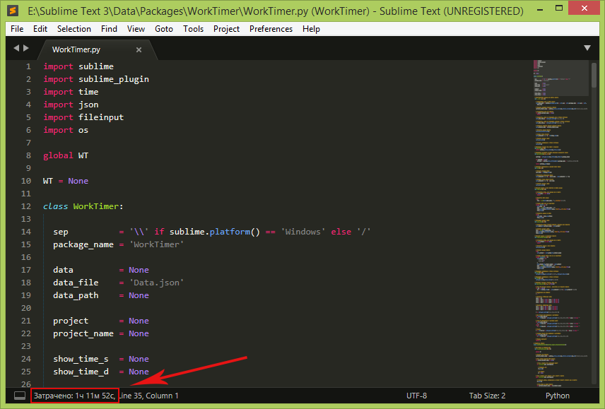
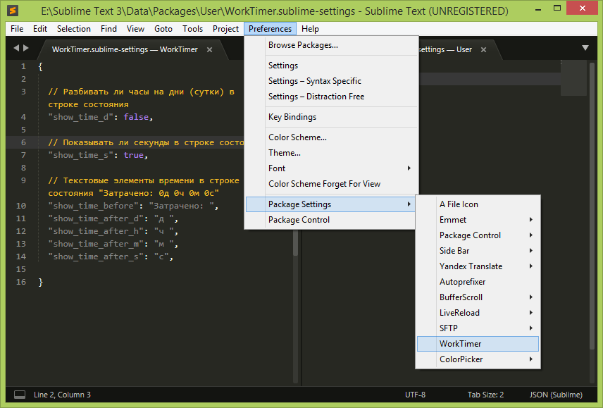
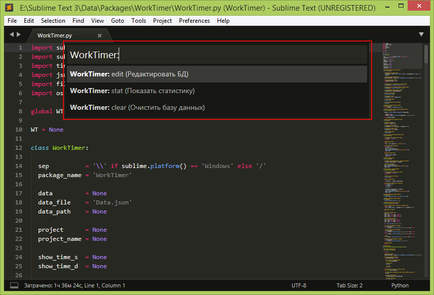

# SiblimeText-WorkTimer
Автоматический учет времени, затраченного на проекты.

## Что считает?
Подсчитывает и суммирует время прошедшее между срезами.

## Когда происходит срез?
Только в открытом проекте.

При попадании фокуса в открытый файл (т.е. при каждом переключении между файлами).

А так же при сохранении файла.

## Что если паралельно открыть еще один проект?
Будет сделан срез предыдущего проекта и начнется отсчет для вновь открытого.

Т.е. будет идти учет проекта который находится в фокусе.

## Как это выглядит?
В строке состояния появится надпись, котрая будет обновляться при каждом срезе.

## Что можно настроить?
Текстовые элементы в строке состояния.

Возможность включить расчет суток.

Возможность включить вывод секунд.

## Есть команды?
Показать статистику - сформирует статистику о всех проектах и покажет в новом окне.

Редактировать файл данных - откроет файл данных (можно удалить/поправить данные о каком то конкретном проекте, важно - проект, который будет редактироваться, - должен быть закрыт).

Очистить файл данных - удалит файл с данными (будет создан при очередном срезе).

В моем случае команды быстро находятся по трем символам: `wtc`, `wts`, `wte`.

## P.S.
Это мой первый опыт на Python.

Плагин делал для себя в первую очердь.

Такого функцонала думаю вполне достаточно.

Хотя конечно много чего еще можно прикрутить, например конвертация времени в стоимость, но уже не охота тратить на это время.
